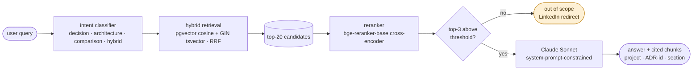

# data-platform-rag

> A RAG answer engine grounded on the architecture decisions of a two-pipeline data platform
> (Kafka + Debezium CDC into Snowflake and Databricks).
> Ask about ingestion trade-offs, governance patterns, or cross-destination differences —
> get answers backed by real ADRs, not model guesses.

[](docs/golden-set/)
[](docs/golden-set/)
[](.github/workflows/ci.yml)
[](LICENSE)

---

## TL;DR

`data-platform-rag` is a retrieval-augmented answer engine built as the knowledge layer over a real two-pipeline data platform. The platform is composed of two production-grade CDC reference projects that share ingestion (Kafka + Debezium against PostgreSQL WAL) and diverge on destination:

- **`sdd-kafka-snowflake-2`** — Snowflake destination (dbt + Dagster, Streams + Triggered Tasks, Schema Registry + Avro governance), 12 ADRs
- **`sdd-kafka-databricks`** — Databricks destination (Lakeflow + Unity Catalog + DABs, YAML data contracts), 9 ADRs + 21 contracts

Users ask questions about platform decisions. The system retrieves relevant chunks from the corpus, reranks them, and generates grounded answers with source citations. Out-of-scope questions receive a fallback message redirecting to the author's LinkedIn.

**Why it exists**: to demonstrate that RAG in 2026 is not a hello-world exercise — it is production-grade retrieval discipline (pgvector + HNSW tuning + hybrid retrieval + RAGAS-measured quality + Langfuse-instrumented cost and traces) applied to the exact kind of technical corpus that an AI Data Engineer builds every day at work.

---

## Architecture

**The query path.** The gate is the load-bearing decision of the project: a
retrieval score below threshold returns the fallback rather than an answer. The
system is allowed to say it does not know, and it is never allowed to answer
without a citation (ADR-006).



**The indexing path.** Offline, not runtime. The corpus is two external repos;
this repo is never indexed into itself. Provenance is the point of the second
table: `corpus_snapshot` records the commit SHA and the embedding model that
produced every row, so *indexed corpus == verified corpus* is a query rather
than a promise (ADR-012, ADR-013).


**What is observed.** Every query produces one Langfuse trace with a child span
per stage, and one row in Postgres `query_log`. The two are deliberately not the
same store: `query_log` is the source of truth for analytics, Langfuse for
observability and scoring. RAGAS scores from evaluation runs attach to the same
trace that produced the query, so eval and production share one score system.

<details>
<summary>Same diagram as plain text</summary>

```
User query
    │
    ▼
Intent classifier (LLM-lite, four categories: decision / architecture / comparison / hybrid)
    │
    ├──► Hybrid retrieval (pgvector cosine + PostgreSQL GIN tsvector, RRF fusion)
    │        │
    │        └──► Top-20 candidates
    │
    ▼
Reranker (bge-reranker-base cross-encoder, top-3 selection)
    │
    ├──► Below-threshold check ──► Fallback: "Out of scope — ask on LinkedIn"
    │
    ▼
Anthropic Claude Sonnet (system-prompt-constrained, citation-required)
    │
    ▼
Answer + cited source chunks (with metadata: project, ADR-id, section)

Every stage traced in Langfuse. Every query logged in Postgres.
```

</details>

---

## Stack

| Layer | Choice | Rationale |
|---|---|---|
| Vector store | PostgreSQL + pgvector | Requirement in target job specs. HNSW indexes, tuned parameters. |
| Sparse search | PostgreSQL GIN + tsvector + ts_rank_cd | Hybrid retrieval without another dependency. |
| Embedding | `bge-small-en-v1.5` | 384-dim, open-source, strong on technical text. Benchmarked during BUILD. |
| Reranker | `bge-reranker-base` | Cross-encoder, ~100ms latency, measurable RAGAS lift. |
| LLM | Claude Sonnet 4.6 (Anthropic API) | Quality on English technical text. Estimated ~$0.008 per non-fallback query.[^cost] |
| Contracts | pydantic v2 | All inter-module boundaries — config, chunk metadata, LLM output, RAGAS reports. |
| Observability | Langfuse (cloud free tier) | Traces every query, tracks Claude cost, receives RAGAS scores. |
| Evaluation | RAGAS | Faithfulness, context precision, answer relevance, context recall. |
| UI | Streamlit | Free hosting, deploys from GitHub. |
| Methodology | AgentSpec/SDD | Same discipline as the two source projects. |

[^cost]: ~1750 input + ~200 output tokens per query (top-3 context) at Claude
    Sonnet 4.6 pricing. Meets the `<$0.01` non-negotiable of
    `docs/PRE_BUILD_VALIDATION.md` Section 7 with headroom for prompt drift.
    Full per-direction arithmetic in
    [.claude/kb/langfuse/cost-tracking.md](.claude/kb/langfuse/cost-tracking.md).
    Estimate until `make eval-ci` produces measured Langfuse cost data.

---

## Status

**What works**:
- (to be filled during BUILD phase)

**What is next**:
- (to be filled during BUILD phase)

**Known gaps and unverified claims**:
- (to be tracked honestly, following the pattern from `sdd-kafka-snowflake-2`)

---

## The data platform

The corpus is a two-pipeline reference platform sharing the same CDC substrate:

```
             ┌────────────────────────────┐
             │  PostgreSQL (source of     │
             │  truth) — 20 domains       │
             └────────────┬───────────────┘
                          │  WAL logical replication
                ┌─────────▼──────────┐
                │  Debezium + Kafka  │
                │  (Confluent, Avro) │
                └─────────┬──────────┘
                          │
             ┌────────────┴────────────┐
             ▼                         ▼
   ┌──────────────────┐      ┌────────────────────┐
   │  Snowflake       │      │  Databricks +      │
   │  (dbt + Dagster) │      │  Unity Catalog     │
   │  Streams + Tasks │      │  Lakeflow + DABs   │
   └──────────────────┘      └────────────────────┘
```

Same input, two destinations, two governance styles — that shared substrate is what makes cross-project comparison questions ("How does each project handle CDC deletes?") answerable and meaningful.

---

## Running it

```bash
# Prerequisites: Docker, Docker Compose, Python 3.11+, an Anthropic API key
# Optional but recommended: Langfuse Cloud account (free tier)
cp .env.example .env
# Edit .env: set ANTHROPIC_API_KEY, and optionally LANGFUSE_* keys

make bootstrap        # start postgres+pgvector, run migrations
make index-corpus     # clone target repos, chunk, embed, upsert
make eval             # run RAGAS against golden set (pushes scores to Langfuse if enabled)
make dev              # streamlit at http://localhost:8501
```

See `Makefile` for all targets.

---

## Roadmap (v2)

Explicitly deferred until v1 is live and measured. Each carries a trigger condition — will only be implemented when the trigger fires.

| Feature | Trigger |
|---------|---------|
| Include source code in corpus | Fallback rate >40% AND log shows implementation questions dominate |
| Query decomposition for multi-hop | Complex questions >20% of traffic AND single-shot answers score low |
| Streaming responses in UI | User feedback shows perceived latency friction |
| Feedback loop (thumbs up/down) | v1 stable and Langfuse feedback integration desired |
| Continuous ingestion (webhook) | Source projects gain regular contributors |
| Redis response cache | Query volume >500/day |
| Active alerts (PagerDuty-style) | Product becomes production-critical |
| Performance tests (p50/p95/p99, throughput) | Query volume or corpus size grows past the point where RAGAS + the `sql/99_verify.sql` EXPLAIN ANALYZE baseline cover the real regression risk |
| Cohere Rerank (paid) | Context Precision plateaus below 0.85 |
| Full BM25 via pg_search extension | ts_rank_cd sparse quality proves inadequate |
| Corpus expansion to more platform components | Additional reference projects added to the platform |

---

## Methodology — AgentSpec / SDD

This project uses the same six-phase workflow that structures `sdd-kafka-snowflake-2` and `sdd-kafka-databricks`:

`brainstorm → define → design → build → iterate → ship`

Each feature lives under `.claude/sdd/features/{feature-slug}/` with phase artifacts. Templates live in `.claude/sdd/templates/`. The `AGENTS.md` file at the repo root is the single source of truth for any coding agent (Cursor, Claude Code, Codex).

---

## License

MIT — see [LICENSE](LICENSE).

## Author

Christian Rocha — [LinkedIn](https://linkedin.com/in/christiandrocha) · [GitHub](https://github.com/christiandrocha)
