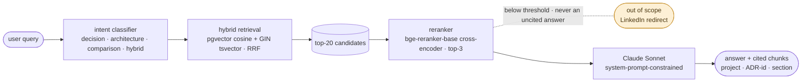
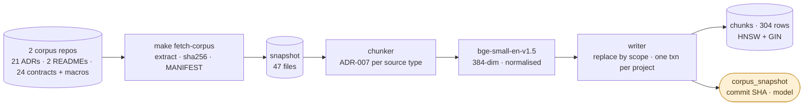
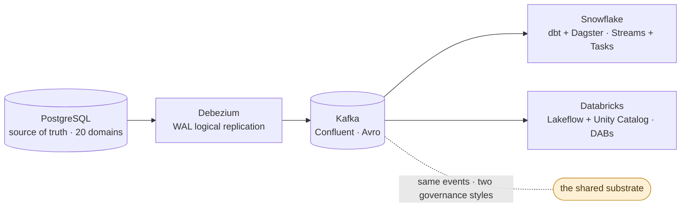

# data-platform-rag

> A RAG answer engine grounded on the architecture decisions of a two-pipeline data platform
> (Kafka + Debezium CDC into Snowflake and Databricks).
> Ask about ingestion trade-offs, governance patterns, or cross-destination differences —
> get answers backed by real ADRs, not model guesses.

[](docs/golden-set/)
[](docs/golden-set/)
[](https://github.com/christiandrocha/data-platform-rag/actions/workflows/ci.yml)
[](LICENSE)

---

## TL;DR

`data-platform-rag` is a retrieval-augmented answer engine built as the knowledge layer over a real two-pipeline data platform. The platform is composed of two production-grade CDC reference projects that share ingestion (Kafka + Debezium against PostgreSQL WAL) and diverge on destination:

- **`sdd-kafka-snowflake-2`** — Snowflake destination (dbt + Dagster, Streams + Triggered Tasks, Schema Registry + Avro governance), 12 ADRs
- **`sdd-kafka-databricks`** — Databricks destination (Lakeflow + Unity Catalog + DABs, YAML data contracts), 9 ADRs + 21 contracts

Users ask questions about platform decisions. The system retrieves relevant chunks from the corpus, reranks them, and generates grounded answers with source citations. Out-of-scope questions receive a fallback message redirecting to the author's LinkedIn.

**Why it exists**: to demonstrate that RAG in 2026 is not a hello-world exercise — it is production-grade retrieval discipline (pgvector + HNSW tuning + hybrid retrieval + RAGAS-measured quality + Langfuse-instrumented cost and traces) applied to the exact kind of technical corpus that an AI Data Engineer builds every day at work.

---

## Architecture

**The query path.** The gate is the load-bearing decision of the project: a
retrieval score below threshold returns the fallback rather than an answer. The
system is allowed to say it does not know, and it is never allowed to answer
without a citation (ADR-006).



**The indexing path.** Offline, not runtime. The corpus is two external repos;
this repo is never indexed into itself. Provenance is the point of the second
table: `corpus_snapshot` records the commit SHA and the embedding model that
produced every row, so *indexed corpus == verified corpus* is a query rather
than a promise (ADR-012, ADR-013).



**What is observed.** Every query produces one Langfuse trace with a child span
per stage, and one row in Postgres `query_log`. The two are deliberately not the
same store: `query_log` is the source of truth for analytics, Langfuse for
observability and scoring. RAGAS scores from evaluation runs attach to the same
trace that produced the query, so eval and production share one score system.

<details>
<summary>Same diagram as plain text</summary>

```
User query
    │
    ▼
Intent classifier (LLM-lite, four categories: decision / architecture / comparison / hybrid)
    │
    ├──► Hybrid retrieval (pgvector cosine + PostgreSQL GIN tsvector, RRF fusion)
    │        │
    │        └──► Top-20 candidates
    │
    ▼
Reranker (bge-reranker-base cross-encoder, top-3 selection)
    │
    ├──► Below-threshold check ──► Fallback: "Out of scope — ask on LinkedIn"
    │
    ▼
Anthropic Claude Sonnet (system-prompt-constrained, citation-required)
    │
    ▼
Answer + cited source chunks (with metadata: project, ADR-id, section)

Every stage traced in Langfuse. Every query logged in Postgres.
```

</details>

---

## Stack

| Layer | Choice | Rationale |
|---|---|---|
| Vector store | PostgreSQL + pgvector | Requirement in target job specs. HNSW indexes, tuned parameters. |
| Sparse search | PostgreSQL GIN + tsvector + ts_rank_cd | Hybrid retrieval without another dependency. |
| Embedding | `bge-small-en-v1.5` | 384-dim, open-source, strong on technical text. Benchmarked during BUILD. |
| Reranker | `bge-reranker-base` | Cross-encoder, ~100ms latency, measurable RAGAS lift. |
| LLM | Claude Sonnet 4.6 (Anthropic API) | Quality on English technical text. Estimated ~$0.008 per non-fallback query.[^cost] |
| Contracts | pydantic v2 | All inter-module boundaries — config, chunk metadata, LLM output, RAGAS reports. |
| Observability | Langfuse (cloud free tier) | Traces every query, tracks Claude cost, receives RAGAS scores. |
| Evaluation | RAGAS | Faithfulness, context precision, answer relevance, context recall. |
| UI | Streamlit | Free hosting, deploys from GitHub. |
| Methodology | AgentSpec/SDD | Same discipline as the two source projects. |

[^cost]: ~1750 input + ~200 output tokens per query (top-3 context) at Claude
    Sonnet 4.6 pricing. Meets the `<$0.01` non-negotiable of
    `docs/PRE_BUILD_VALIDATION.md` Section 7 with headroom for prompt drift.
    Full per-direction arithmetic in
    [.claude/kb/langfuse/cost-tracking.md](.claude/kb/langfuse/cost-tracking.md).
    Estimate until `make eval-ci` produces measured Langfuse cost data.

---

## Status

Last updated 2026-09-18, against `sdd-kafka-snowflake-2@82a2e269` and
`sdd-kafka-databricks@f1295df9`.

**What works** — every line below is reproducible from a clean checkout:

- `make bootstrap` — Postgres + pgvector, schema and indexes. Create-only and
  idempotent; the destructive path is `make reset-db` and nothing else runs it.
- `make fetch-corpus` — shallow-clones both corpus repos, extracts the **47**
  in-corpus files, writes a `MANIFEST.json` with the commit SHA per project and
  a sha256 per file, and deletes the clone. The in-corpus file set is defined
  once, in `indexer/corpus.py`.
- `make index-corpus-dry` — chunks per ADR-007 (as amended): **304 chunks**,
  median 209 tokens, largest 500, every one inside the 512-token window.
- `make index-corpus` — embeds with `bge-small-en-v1.5` and writes **304 rows**,
  384-dimensional, replacing one project scope per transaction. Re-running is a
  no-op; `make reindex` re-embeds without ever being able to leave the index
  empty.
- `make index-corpus-verify` — asserts *indexed corpus == verified corpus* by
  comparing `corpus_snapshot` against the manifest. This is the point of
  ADR-012 and ADR-013: a score can name the commit it was measured against.
- `make verify-adversarials` — the ADR-011 blocking gate, which now has a
  canonical input instead of a local path override.
- `make lint` clean, `make test` **131 passing**, both green in CI.

**What is next**, in dependency order — none of this exists yet:

1. **Retrieval executor.** The RRF query is written, as a SQL constant in
   `retrieval/hybrid_search.py`. Nothing runs it: there is no function that
   takes a question and returns chunks.
2. **Reranking** (ADR-005, still Planned).
3. **Generation.** The system prompt is versioned in `generation/prompt.py`.
   There is no Anthropic client and no fallback logic behind it.
4. **Intent classifier**, then the pipeline that joins the four stages above.
5. **Langfuse wiring.** Only the no-op fallback exists today.
6. **Streamlit UI** — currently a placeholder page that says so.
7. **RAGAS runner** (ADR-008, still Planned), and the golden set from 5 to 50.

**Known gaps and unverified claims**:

- **No answer-quality number exists, because nothing answers yet.** The RAGAS
  badges read `pending` and will keep reading it until `make eval-ci` has run.
  No number here comes from an estimate.
- **The golden set holds 5 of 50 questions.** Any metric computed today would be
  measured against a tenth of its intended sample.
- **`ragas.yml` in CI calls `make eval`, which has nothing to evaluate.** Expect
  that workflow red until step 7 above lands. The `ci.yml` lint and test jobs are
  green and are the ones that mean something right now.
- **ADR-004 is still Planned, and it covers two things neither of which is
  done.** `bge-small-en-v1.5` is the *declared baseline*, chosen by argument and
  never benchmarked against an alternative. The HNSW parameters (`m = 16`,
  `ef_construction = 64`) are library defaults, not values tuned against the
  golden set — which AGENTS.md requires before they can be called tuned.
- **The HNSW index is proven usable, not proven chosen.** At 304 rows the
  planner prefers a sequential scan, correctly. `sql/99_verify.sql` forces the
  index to show it returns the same rows roughly twice as fast; it does not
  claim the planner picks it.
- **`topic` and `keywords` are `NULL` on every row.** Extraction has never run.
  The partial GIN index exists for the day it does.
- **`adr_id` is not canonicalised** across the three spellings the corpus uses,
  and is unqualified by project.
- **The `schema` source type has no producer.** The Schema Registry subjects
  live in a running registry, not in either repo, so no file in the corpus
  produces that type (ADR-012).
- **Re-indexing a project re-embeds all of its chunks**, unchanged ones
  included: 74–88 s for this corpus. A known limit at this scale, not a hidden
  one.

---

## The data platform

**One substrate, two destinations.** The corpus is a two-pipeline reference
platform. The marked node is the load-bearing part: the same CDC events feed
both sides, so the two projects differ in governance rather than in input — and
that is what makes a cross-project question ("how does each project handle CDC
deletes?") answerable rather than a comparison of apples to oranges.



<details>
<summary>Same diagram as plain text</summary>

```
             ┌────────────────────────────┐
             │  PostgreSQL (source of     │
             │  truth) — 20 domains       │
             └────────────┬───────────────┘
                          │  WAL logical replication
                ┌─────────▼──────────┐
                │  Debezium + Kafka  │
                │  (Confluent, Avro) │
                └─────────┬──────────┘
                          │
             ┌────────────┴────────────┐
             ▼                         ▼
   ┌──────────────────┐      ┌────────────────────┐
   │  Snowflake       │      │  Databricks +      │
   │  (dbt + Dagster) │      │  Unity Catalog     │
   │  Streams + Tasks │      │  Lakeflow + DABs   │
   └──────────────────┘      └────────────────────┘
```

</details>

---

## Running it

```bash
# Prerequisites: Docker, Docker Compose, Python 3.11+, an Anthropic API key
# Optional but recommended: Langfuse Cloud account (free tier)
cp .env.example .env
# Edit .env: set ANTHROPIC_API_KEY, and optionally LANGFUSE_* keys

make bootstrap        # start postgres+pgvector, run migrations
make index-corpus     # clone target repos, chunk, embed, upsert
make eval             # run RAGAS against golden set (pushes scores to Langfuse if enabled)
make dev              # streamlit at http://localhost:8501
```

See `Makefile` for all targets.

---

## Roadmap (v2)

Explicitly deferred until v1 is live and measured. Each carries a trigger condition — will only be implemented when the trigger fires.

| Feature | Trigger |
|---------|---------|
| Include source code in corpus | Fallback rate >40% AND log shows implementation questions dominate |
| Query decomposition for multi-hop | Complex questions >20% of traffic AND single-shot answers score low |
| Streaming responses in UI | User feedback shows perceived latency friction |
| Feedback loop (thumbs up/down) | v1 stable and Langfuse feedback integration desired |
| Continuous ingestion (webhook) | Source projects gain regular contributors |
| Redis response cache | Query volume >500/day |
| Active alerts (PagerDuty-style) | Product becomes production-critical |
| Performance tests (p50/p95/p99, throughput) | Query volume or corpus size grows past the point where RAGAS + the `sql/99_verify.sql` EXPLAIN ANALYZE baseline cover the real regression risk |
| Cohere Rerank (paid) | Context Precision plateaus below 0.85 |
| Full BM25 via pg_search extension | ts_rank_cd sparse quality proves inadequate |
| Corpus expansion to more platform components | Additional reference projects added to the platform |

---

## Methodology — AgentSpec / SDD

This project uses the same six-phase workflow that structures `sdd-kafka-snowflake-2` and `sdd-kafka-databricks`:

`brainstorm → define → design → build → iterate → ship`

Each feature lives under `.claude/sdd/features/{feature-slug}/` with phase artifacts. Templates live in `.claude/sdd/templates/`. The `AGENTS.md` file at the repo root is the single source of truth for any coding agent (Cursor, Claude Code, Codex).

---

## License

MIT — see [LICENSE](LICENSE).

## Author

Christian Rocha — [LinkedIn](https://linkedin.com/in/christiandrocha) · [GitHub](https://github.com/christiandrocha)
